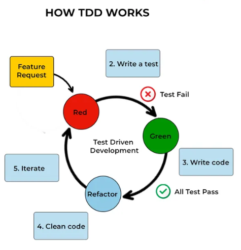

# TDD Spring Boot Task Management Application

This repository contains a Spring Boot application for managing tasks, developed using **Test-Driven Development (TDD)** principles. The application includes functionalities to create tasks. Below are the steps followed to implement TDD for this project.

---

## Table of Contents
- [Project Overview](#project-overview)
- [TDD Steps](#tdd-steps)
    - [Step 1: Write Tests](#step-1-write-tests)
    - [Step 2: Implement Code](#step-2-implement-code)
    - [Step 3: Refactor](#step-3-refactor)
- [Getting Started](#getting-started)
- [Usage](#usage)
- [Developer](#developer)
- [Running the Application](#running-the-application)

---

## Project Overview
The **Task Management Application** is a RESTful API built with **Spring Boot**.
It allows users to perform task creation. The application follows **TDD principles** to ensure high code quality and maintainability.

---

## TDD Steps

### Step 1: Write Tests
The first step in **TDD** is to write tests for the desired functionality **before implementing the code**. This ensures that the code meets the specified requirements.

**Example Test:**

```java
@WebMvcTest(TaskController.class)
public class TaskControllerTest {

    @Autowired
    private MockMvc mockMvc;

    @Autowired
    private ObjectMapper objectMapper;

    @MockBean
    private TaskRepository taskRepository;

    @Test
    public void testCreateTask() throws Exception {
        Task task = new Task("Test Title", "Test Description");
        when(taskRepository.save(any(Task.class))).thenReturn(task);

        mockMvc.perform(post("/tasks")
                        .contentType(MediaType.APPLICATION_JSON)
                        .content(objectMapper.writeValueAsString(task)))
                .andExpect(status().isCreated());
    }
}
```

---

### Step 2: Implement Code
After writing the tests, the next step is to **implement the minimum code** required to pass the tests. This ensures that the code is functional and meets the specified requirements.

**Example Implementation:**

```java
@RestController
@RequestMapping("/tasks")
public class TaskController {

    private final TaskRepository taskRepository;

    public TaskController(TaskRepository taskRepository) {
        this.taskRepository = taskRepository;
    }

    @PostMapping
    public ResponseEntity<Task> createTask(@RequestBody Task task) {
        Task createdTask = taskRepository.save(task);
        return new ResponseEntity<>(createdTask, HttpStatus.CREATED);
    }
}
```

---

### Step 3: Refactor
The final step in TDD is to **refactor the code** to improve its structure, readability, and maintainability while ensuring that all tests still pass.

**Example Refactoring:**

```java
@RestController
@RequestMapping("/tasks")
public class TaskController {

    private final TaskRepository taskRepository;

    public TaskController(TaskRepository taskRepository) {
        this.taskRepository = taskRepository;
    }

    @PostMapping
    public ResponseEntity<Task> createTask(@RequestBody Task task) {
        validateTask(task);
        Task createdTask = saveTask(task);
        return new ResponseEntity<>(createdTask, HttpStatus.CREATED);
    }

    private void validateTask(Task task) {
        if (task.getTitle() == null || task.getTitle().isEmpty()) {
            throw new IllegalArgumentException("Title cannot be null or empty");
        }
        if (task.getDescription() == null || task.getDescription().isEmpty()) {
            throw new IllegalArgumentException("Description cannot be null or empty");
        }
    }

    private Task saveTask(Task task) {
        return taskRepository.save(task);
    }
}
```

---

## Getting Started
To get started with the **Task Management Application**, follow these steps:

### Clone the repository:
```bash
  git clone https://github.com/Abrahim-diallo/TDD-spring-boot-TODO-App.git

  cd task-management-app
```

### Build the project:
```bash
  ./mvnw clean install
```

### Run the application:
```bash
  ./mvnw spring-boot:run
```

---

## Usage
The **Task Management Application** provides the following REST API endpoint:

- **Create a Task**: `POST /tasks`

---

## Developer
**M Diallo**

---

## Running the Application
To run the **Spring Boot Application** locally, you can choose between the following options:

### Without running tests:
```bash
  mvn spring-boot:run -DskipTests -Dspring.profiles.active=local
```

### With tests:
```bash
  mvn spring-boot:run -Dspring.profiles.active=local
```

---

This README provides a clear and concise overview of the **Task Management Application** developed using **TDD principles** with **Spring Boot**. It includes steps for getting started, usage instructions, and guidelines for contributing.

Happy Coding! 🚀
